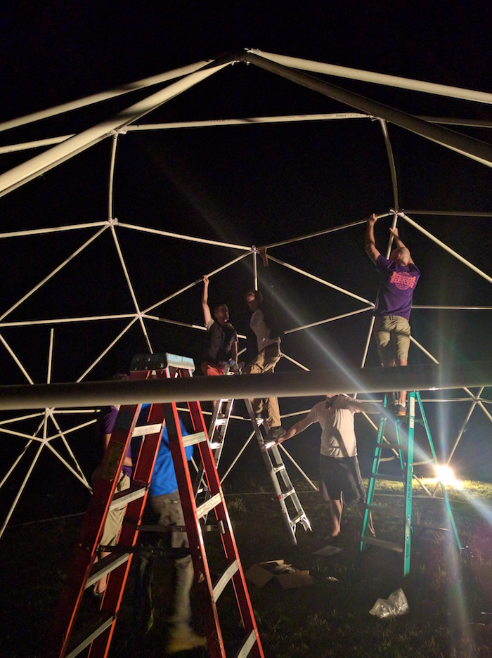

* [Processing Simulator](https://github.com/hackrockcity/DomeStar2Simulator)
* [Processing Transmitter](https://github.com/hackrockcity/DomeStar2)
* [Hardware, Firmware and Host](https://github.com/hackrockcity/domeFirmware) (by Max Henstell and Matt Mets)
* [DomeStar 2.0 GoFundMe](https://www.gofundme.com/domestar/)

<iframe src="gallery" frameborder="0" width="720" height="545" scrolling="no"></iframe>

## Summary

DomeStar is a 25-foot diameter dome covered by 6,400 addressable RGB LEDs.  The LEDs are spread out over 40 strips of 5 meters each.  Several collaborators have contributed to the project.  [Max Henstell](http://www.kapamaki.net/) designed the hardware, [Matt Mets](http://www.blinkinlabs.com/) developed the firmware and proxy software and I developed the Processing framework for the various routines it displays.  

DomeStar was shown at the [NYC Resistor Interactive Show](http://www.flickr.com/photos/osr/sets/72157629813571332/with/7233737690/), [Disorient Country Club](http://disorientcountryclub.com/), [PEX Summer Festival](http://www.pexsummerfestival.com/), [Burning Man](http://www.burningman.com/), the [Open Hardware Summit](http://summit.oshwa.org/) and [World Maker Faire](http://makerfaire.com/newyork/2012/index.html).

The project has been bouncing around since 2012.  It was rebooted with a new dome and new software in May 2016.

## Implementation

### The Strips

We used strips based on the <a href="http://www.adafruit.com/datasheets/HL1606S.pdf">LPD8806</a>, similar to the ones you'll find at <a href="https://www.adafruit.com/products/306">adafruit</a>.  These strips have proven to be fairly durable having been repeatedly wound, unwound, overheated, zip tied, lied on and occasionally stepped upon.  You can see in the picture above that some of the spools have warped from the heat of running the LEDs at full brightness while still spooled.  The most common failure has been with the connections on the LPD8806 chip.  We cleaned these up by cutting open the housing and hitting it with a little solder and flux.

### The Controllers

<a href="https://github.com/mhenstell">Max Henstell</a> designed the <a href="https://github.com/hackrockcity/domeFirmware/tree/master/board">controller boards</a>.  They serve two purposes: connect a <a href="http://www.pjrc.com/teensy/">Teensy 2.0</a> to 8 strips to which data is sent in parallel (more on that below), and step the 12V coming from the power supplies down to 5V.  He ran 12V to the controller so that we can use wire of a reasonable gauge.

### The Power Supply

Max also put together the power supply, pictured here with a fresh coat of playa dust.  It's 5 x 12V DC power supplies housed in a convenient carrying case with some pretty sweet <a href="http://www.alliedelec.com/search/productdetail.aspx?sku=70088599&gclid=CICB5OfT6LICFQuk4Aod9lQACQ">Neutrik NAC3FCB</a> locking connectors.

### The Firmware and Driver

<a href="http://www.blinkinlabs.com/">Matt Mets</a> wrote the <a href="https://github.com/hackrockcity/domeFirmware/tree/master/firmware">firmware</a> that runs on each Teensy.  It's really simple - take every byte that comes through the USB and pass it to the data port.  It sets the clock port low just before each data byte, and high just after.

Each controller board is connected so that we're talking to 8 strips in parallel.  Each byte sent over USB represents 1 bit on 8 strips.  The registers that control the ports are set all at once rather than one bit at a time.

The <a href="https://github.com/hackrockcity/domeFirmware/tree/master/c++_host">host software</a> is responsible for taking image data sent over the network via UDP, chopping it up so that it addresses the strips in parallel, adding in the latch signal, and sending it over 1 or more USB ports.  This is really where a lot of the magic lies.  Matt spent a long time figuring out ways to manage this using parallel threads so we could keep the frame rate up.  There's also a slower, but easier to understand, <a href="https://github.com/hackrockcity/domeFirmware/tree/master/python_host">python version</a>.
  

### The Animation Software

The final piece of the puzzle is the animation software.  We used a Processing sketch forked from the [Art Car Wash Sign](/projects/acw).

The protocol was kept the same as the ACW, a simple stream of bytes sent over UDP to feed the host software.  A [simulator](https://github.com/hackrockcity/BlinkeyDomeSimulator) was written so we could work on routines without having everything set up.  In practice we tended to just visualize in our heads what the tiny 40 x 160 pixel image would look like when mapped on a 16-foot dome.  Matt has proven especially good at this, writing many seemingly simple patterns that look stunning on the dome.

## DomeStar 2.0

In 2016 we rebooted the DomeStar project.  We replaced the dome itself, added a foam diffuser layer to the strips, CNCed some new mounting hardware, added sound, and rewrote all the animation software.  [Eric Mortensen](http://imageoscillite.com/) lead the fundraising effort on [GoFundMe](https://www.gofundme.com/domestar/).

### New Dome

We replaced the old flattened and drilled 16-foot PVC dome with a 25-foot one that uses actual connector hubs from [SonoStar](http://www.sonostarhub.com/megahubs.html).  We decided to stick with PVC because it's lightweight and easy for us to transport.

The size presented their own set of challenges.  We needed to use bigger ladders, and in some cases ladders stacked on boxes.

### Diffuser

I started by testing the strips in a white pool noodle.  The effect is very nice, as you can see in this video.

<iframe width="420" height="315" src="https://www.youtube.com/embed/pfwa7iA-bGo" frameborder="0" allowfullscreen></iframe>

We couldn't get white pool noodles in the kind of volume we needed so we settled for EPE foam used for pipe insulation which was a little thinner and not as rigid.  You can also see the new mounting hardware here.

<iframe width="420" height="315" src="https://www.youtube.com/embed/35Fl1-HdmZw" frameborder="0" allowfullscreen></iframe>

### New Software

I built a new [framework](https://github.com/hackrockcity/DomeStar2) and updated the [simulator](https://github.com/hackrockcity/DomeStar2Simulator).  We introduced mapping that allowed for easier development of routines.  Brian O'Clair and Jared Klett contributed routines.  [Eric Mortensen](http://imageoscillite.com/) curated a number of videos that could be played with the mapper.

### Audio

[Eric Mortensen](http://imageoscillite.com/) spearheaded audio integration into the project.  Disorient loaned us a four speaker sound system on which Eric plays some interative generative music also controlled by WiiMote.  

## Other Stuff and Next Steps

DomeStar has been one of my favorite projects to return to.  It continues to be popular at regional burns despite having appeared more times than I care to count.  Every time we bring it out we try to add something fresh to the installation.  Not everything has worked.

### DomeStar.us 

I created a mobile web app that reads your phones accelerometer data and feeds it back to the dome.  The idea is to turn your phone into a paintbrush that will be able to paint color onto the dome.  Connectivity an calibration issues have proven too difficult to use it in practice.

### More strips and the swirl

Should DomeStar continue to appear the next most obvious upgrade would be to add more strips.  6400 LEDs just aren't that impressive anymore.  I think doubling the count would be a straightforward upgrade.  I would also like to experiment with mounting the strips at an angle so that the LEDs are distributed more horizontally.  The current aspect ratio of 1:4 makes recognizable imagery really challenging.

### Asterix

* [GitHub](https://github.com/hackrockcity/D15AsterixTransmitter)
* [Asterix at Disorient Wiki](http://wiki.disorient.info/index.php?title=Geodesic_Temple#Asterix_.28Burning_Man_2015.29)

DomeStar's LEDs were repurposed for the octahedron structure in front of Disorient at Burning Man 2015.  I also participated in the physical build
of the structure.  

Because of the harsh envrionmental conditions at Burning Man, I changed the power supplies for sealed [Meanwell 5V supplies](https://www.meanwell-web.com/product_info.php/cPath/577_588_967_1014_1028/products_id/LPV-100-5).  [Matt Mets](http://www.blinkinlabs.com/) made a quick change the PCB to support it.

We also used a Raspberry PI to run the UDP->USB host code.  The laptop that ran the Processing code was kept in a container back in camp.  We ran a long ethernet cable out to the structure to connect to the PI.  It worked reasonably well, but an off-by-one error somewhere caused glitches in the color.  I just kept all the routines white rather than ferreting out the bug, because Burning Man.
