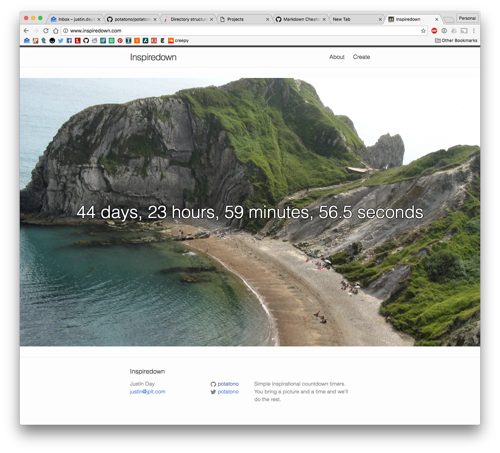

* [Inspiredown Website](http://www.inspiredown.com/)
* [Inspiredown Source](https://github.com/potatono/inspiredown)

## Summary

Inspiredown is a simple weekend-ish project to build a simple customizable countdown timer with an inspirational picture as a background.
I built it in the run up to my summer off after MakerBot.  

## Implementation

Inspiredown is simple, but it does have some clever bits.

* Built entirely as client side.
* Uses [Firebase](http://www.firebase.com/) as the backend.
* Tries to be as mobile friendly as possible
* Resizes and iconifies the image you supply in a hidden canvas (if [CORS](https://en.wikipedia.org/wiki/Cross-origin_resource_sharing) allows)

