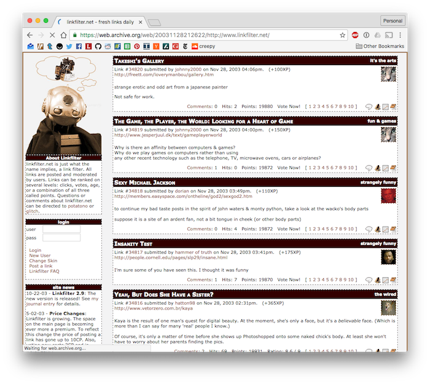
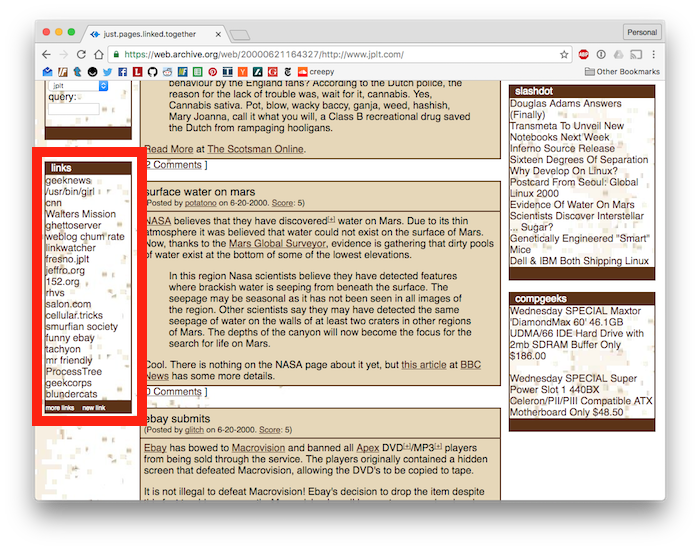
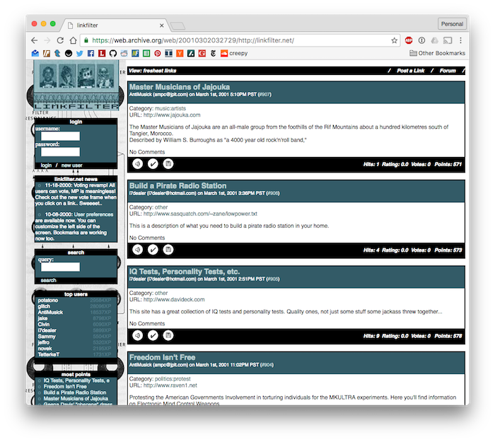
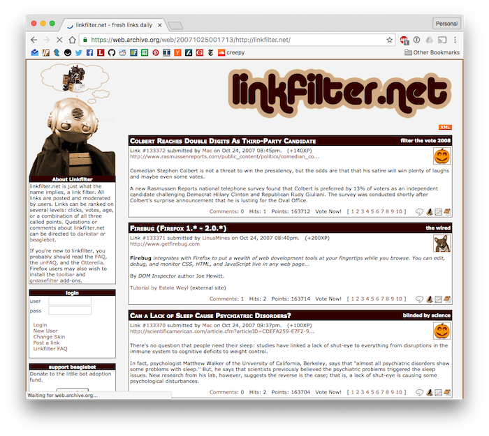
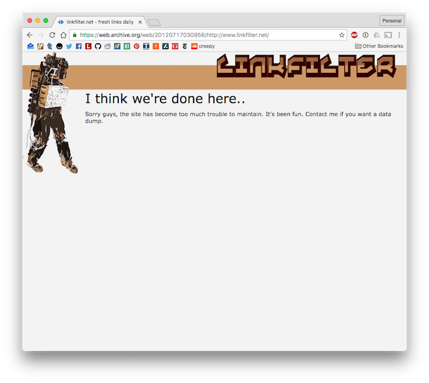
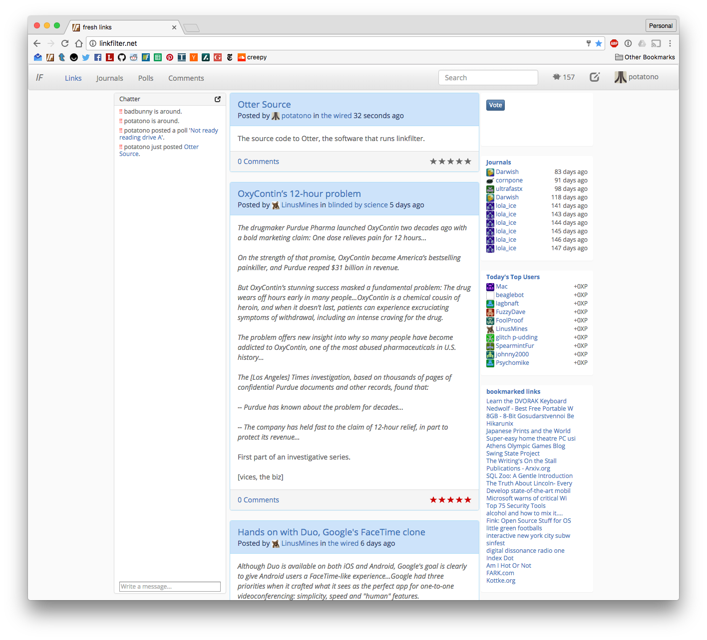

* [Linkfilter](http://linkfilter.net)
* [Otter Source Code](http://github.com/potatono/lf2)

## Summary

Linkfilter is a community weblog driven by game mechanics.  Users contribute links and other content and are rewarded with experience points which drive a leveling system.  Higher levels grant users additional powers and contribution points which can be spent to post increasing amounts of content.  The system proved to be fairly effective at both driving user engagement as well as preventing spam.

## Implementation

Linkfilter is by far my longest semi-continuous project.  It's a pretty
standard LAMP stack application, with the "P" standing for perl in this
case.

### Otter

Linkfilter's framework, named Otter, has overgone several total overhauls.  The latest brings in a ton of ideas and functionality from Otter's use as the backend of blip.tv.  Some of the features supported by Otter include:

* Dynamic SQL query generation and ORM
* Two levels of caching (memcached and in-process)
* Support for FastCGI, mod_perl and running standalone
* HTML::Template::Compiled templating with a parent/child build system
* Fast RSS generation and XSLT translation
* Simple schema tracking/management

### Posts

Linkfilter features three post types: links, journals and polls.  Users have to earn access to each post type by leveling up.

### Levels and Economy

Linkfilter's leveling and economy system is a bit complex.  It consists of
a few components:

* Levels
* Exeperience Points (XP)
* Contribution Points (CP)

Nearly all interactions with the site result in varying amounts of XP.  New
users will need to spend a significant amount of time rating links and posting comments before they will hit a high enough level to post links
and other content.

Hitting a new level results in a playful "Level Up!" photo being displayed.  Most of these photos are some mashup from a popular photo and most were contributed by the Linkfilter user base.

With each level comes increased abilities and additional CP awarded per day.  Contribution Points are spent to post content, the prices of which change based on number of posts in a row, or in a day.

### Chat

One of the most unique features of linkfilter, especially for its hay-day, is chat.  The live chat really made the site sticky, and built a tight knit community.

## Community

The linkfilter community took on a life of its own.  It spawned a bunch of hidden features, content and memes.  They even had an annual secret santa exchange.

One of the most notable was hatepup, a dog photoshoped in a staggering number of photos.  He would often appear with text like "Plez dawn't leek mah bawls"

* [Electric Otterella](http://linkfilter.net/journals/7118) - A collection of LF related content
* [The Cult of Hatepup](http://blog.worshiptheglitch.com/post/4585410328/the-cult-of-hatepup)

## History

### Origins

Linkfilter started life as a side box on the JPLT blog.

The amount of effort it took to feed JPLT every day and the popularity of the links box inspired the creation of Linkfilter.

### Launch

When linkfilter launched in 2000 it was fairly simple, but had already started to include gamification features.

### Rewrite, new features

Linkfilter was rewritten about a year later and many new features were added including the chat, journals and polls.  

Linkfilter ran more or less like this for the next 10 years.  The user base grew significantly but stagnated due to lack of conitnued development.

### Blip

Otter was forked in 2005 and eventually became the basis of blip.tv.  It was refactored heavily and a large number of features were added/changed.

The workload of blip.tv left me with little attention to pay to linkfilter.  I eventually handed over administrative duties to community members.

New user account creation was disabled due to aggressive spammer tactics. The site languished.

### Shutdown

After a series of server malfunctions and scaling issues I shut down linkfilter.

### Reboot

A facebook group for linkfilter users continues today.  When someone asked for a data dump I decided to do one better and reboot the site.  I did another major overhaul of the codebase, merging in ideas from blip.  I also built a fresh skin that uses modern HTML5 markup and features.

I have not re-enabled account creation, nor shared it with anyone but the linkfilter facebook group.  It's more of an archive in this form.

### Future

I would like to revisit linkfilter soon.  I'd like to merge the post types into a single view, add several new types, and refactor the economy to have real supply/demand dynamics.

