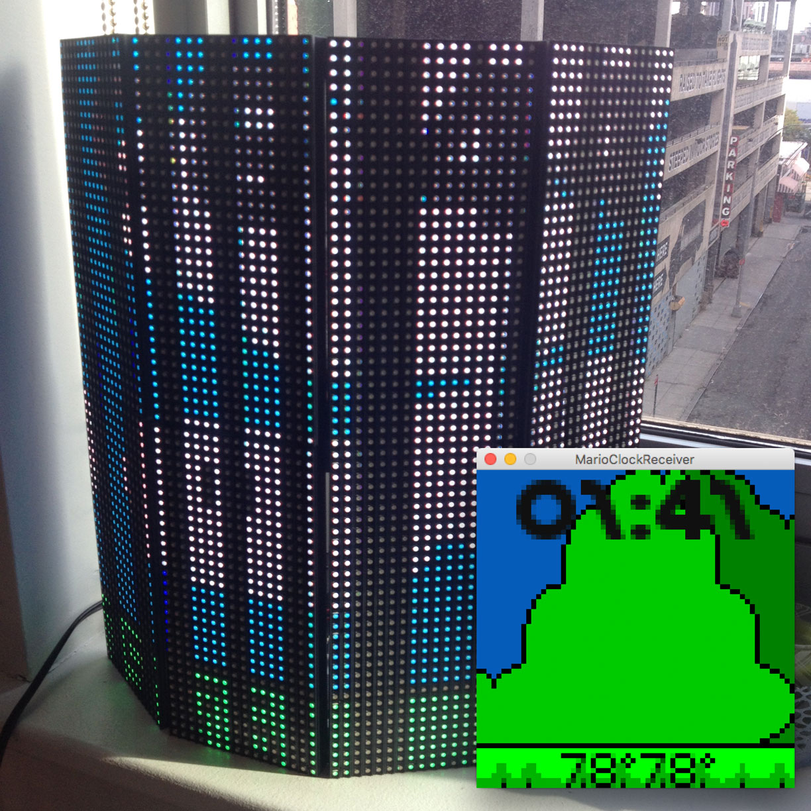

* [Source Code](https://github.com/potatono/ledscape-mario-clock)

## Summary

I used some LED panels and [LEDscape](https://github.com/osresearch/LEDscape) to make a Mario
themed clock.  It pulls current weather from [Dark Sky](https://developer.forecast.io/) and 
 uses [PIL](https://pypi.python.org/pypi/Pillow) to build the mario landscape to match.  It  
incorporates rain, snow, windspeed, cloud cover and time of day.

Unfortunately my phone's camera couldn't get an entire frame of the LEDs so you see striping
here.

