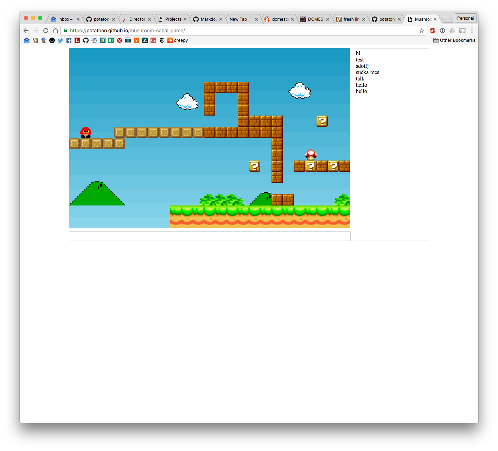

* [Demo](http://potatono.github.io/mushroom-cabal/)
* [GitHub](http://www.github.com/potatono/mushroom-cabal/)
* [Concept PDF](https://github.com/potatono/mushroom-cabal-game/raw/master/Mushroom%20Cabal%20Concept.pdf)

## Concept

Mushroom Cabal is an experiment trying to create a space to hang out in, connect with people, and share
thoughts and ideas.  My favorite experiences at Burning Man center around spending time in small 
installations having deep conversations with friends and strangers alike.  I feel comfortable in these
spaces and tend to share more than I otherwise do normally.  

Social networks do a poor job of serving introverts, rewarding extroverted behavior almost exclusively.
That dynamic drives the power law mechanics you see on most sites, where 80% of the attention is driven
by 20% of the user base.  

The rest of the user base only shares reactions (likes, reblogs, etc) because the risk level of sharing
more substantively is too high.  There's too much attention at stake, or a feeling that their content 
won't be interesting enough.

Keeping groups small and interactions completely ephemeral decreases the risk associated with sharing.

Having a focus that is interactive yet passive enough to allow for conversation keeps the group engaged
and the convesation flowing.

## Implementation

Mushroom Cabal is built in javascript using the [Phaser.IO](http://www.phaser.io/) framework.  It uses
[Firebase](http://www.firebase.com) as a backend.

The project is still very much a work in progress.